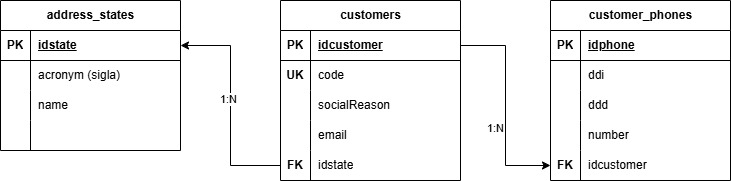

Veja a modelagem dos dados realizadas:



Para se realizar a query:

```SQL
SELECT CONCAT(p.ddi, p.ddd, p.number) AS phone, c.code AS code, c.social_reason AS social_reason, c.email AS email FROM customers c INNER JOIN customer_phones p ON p.idcustomer = c.idcustomer INNER JOIN address_states a ON c.idstate = a.idstate WHERE a.acronym = "SP";
```